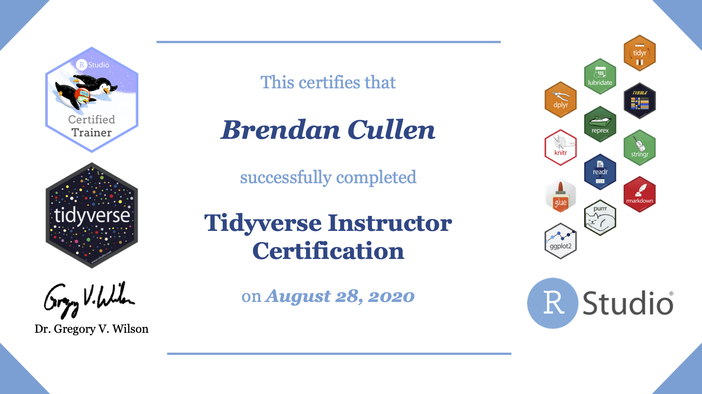

# rstudio-instructor-certification
My materials for the [RStudio Instructor Certification](https://education.rstudio.com/trainers/) Teaching Exam. Feel free to share and re-use!

# Sample lesson: Column-wise operations with `dplyr`: Old and New

## Slides
https://columnwise-operations-dplyr.netlify.app. 
 

## Formative assessment exercises
https://brendancullen.shinyapps.io/columnwise_operations_formative_assessment

## Learner persona

 

## Concept map

 

# Certificate

