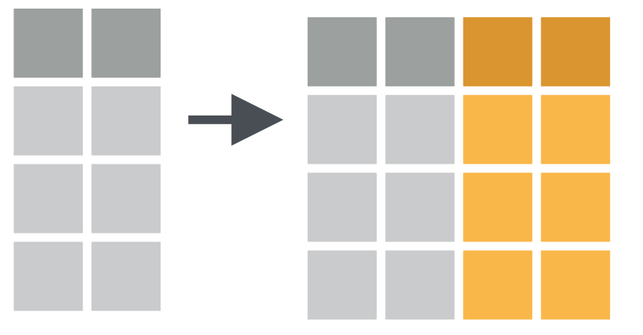
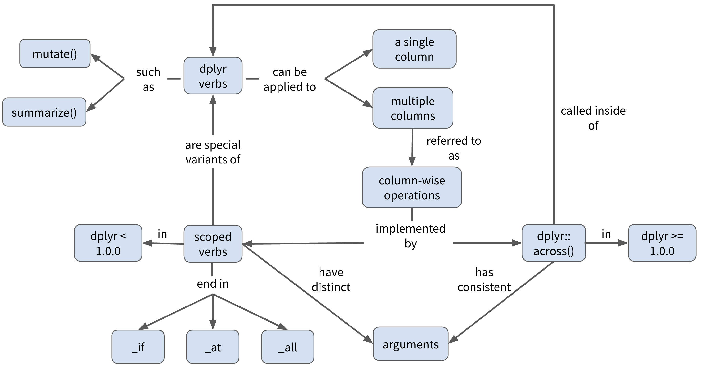

class:inverse

```{r setup, echo=FALSE}
library(xaringanExtra)
library(flair)
```

```{r xaringan-panelset, echo=FALSE}
xaringanExtra::use_panelset()
```

```{css, echo=FALSE}
pre {
  max-width: 100%;
  overflow-x: scroll;
}

.inverse {
  background-color: #272822;
  color: #d6d6d6;
  text-shadow: 0 0 20px #333;
}
```

# Learner Persona: Christina Colwise

<center>
```{r echo = FALSE, out.width = "60%"}
knitr::include_graphics("img/christina_colwise.png")
```
</center>

---
# Christina Colwise

.pull-left[


]


.pull-right[
## General Background

- First-generation student part-way through her first year of a PhD program in Quantitative Psychology. 
]

---

# Christina Colwise

.pull-left[


]


.pull-right[
## Starting Point

- Has introductory working knowledge of the tidyverse

- Frequently uses common `dplyr` verbs for simple data transformations
]

---

# Christina Colwise

.pull-left[


]


.pull-right[
## Needs

- Wants to do more complex operations with `dplyr` verbs

- Apply data transformations to multiple columns at the same time
]

---

# Christina Colwise

.pull-left[


]


.pull-right[
## Special Considerations

- Works a full-time job during grad school

- Balances a heavy coursehold and has limited bandwidth to learn new things

- Wants to learn functions she can apply right away for analyzing data for her first year project 
]

---
class: inverse

# Learning objectives

--

- ***Review*** how to apply `dplyr` functions, e.g. `mutate()`, `summarize()`, to single columns

<br>
--

- ***Learn*** how to perform column-wise operations two ways: 

  - using scoped verbs, e.g. `summarize_at()`, `summarize_if()`, etc...

  - using `across()` from `dplyr` 1.0.0

--

<br>

- ***Apply*** `across()` to summarize multiple columns of data

<br>

---
background-image: url(img/dplyr_hex_old.png)
background-position: 90% 5%
background-size: 10%

# Column-wise operations

**Column-wise operations** refers to applying the same `dplyr` verbs (or other data transformation functions) to multiple columns simultaneously. 

--

e.g. Create multiple new columns with `mutate()`

```{r echo = FALSE, out.width = "40%"}

```

--

e.g. Summarize multiple columns with `summarize()`

```{r echo = FALSE, out.width = "40%"}
knitr::include_graphics("img/summarize_multiple.png")
```

---
background-image: url(img/penguins_hex.png)
background-position: 90% 5%
background-size: 10%

# Palmer Penguins

```{r warning=FALSE, message=FALSE}
library(tidyverse)
library(palmerpenguins)
```

```{r}
glimpse(penguins)
```

---
background-image: url(img/dplyr_hex_old.png)
background-position: 90% 5%
background-size: 10%

# Column-wise operations

***Let's review...***

Apply `summarize()` to a **single** column.

```{r echo = FALSE, out.width = "20%"}
knitr::include_graphics("img/summarize_single.png")
```

--

.panelset[

.panel[.panel-name[Example]
`r emo::ji("thinking")` Use `summarize()` to calculate the mean `bill length` for each `species` in the `penguins` dataset
]

.panel[.panel-name[Code]

```{r summarize-one-col, eval=FALSE}
penguins %>% 
  group_by(species) %>% 
  summarize(bill_length_mm = mean(bill_length_mm, na.rm = TRUE))
```
]

.panel[.panel-name[Output]

```{r ref.label="summarize-one-col", echo=FALSE, message=FALSE}
```

]
]
---
name: multiple columns
background-image: url(img/dplyr_hex_old.png)
background-position: 90% 5%
background-size: 10%

# Column-wise operations

Apply `summarize()` to **multiple columns** at once

```{r echo = FALSE, out.width = "20%"}
knitr::include_graphics("img/summarize_multiple.png")
```

--

.panelset[

.panel[.panel-name[Example #1]
.pull-left[
`r emo::ji("thinking")` Calculate the mean value of **all bill dimensions** (i.e. `bill_length`, `bill_depth`) for each species

`r emo::ji("no_entry_sign")` Avoid copying and pasting or repeating `mean()` more than once in your solution
]

.pull-right[
```{r echo = FALSE, out.width = "100%"}
knitr::include_graphics("img/culmen_depth.png")
```
]

.pull-right[Artwork by @allison_horst]

]

.panel[.panel-name[Code]
```{r summarize-mult-1, eval=FALSE, echo = FALSE}
penguins %>% 
  group_by(species) %>% 
  summarize_at(vars(c(bill_length_mm, bill_depth_mm)), 
               mean, na.rm = TRUE)
```

```{r echo=FALSE}
decorate("summarize-mult-1", eval = FALSE) %>% 
  flair("summarize_at")
```

`r emo::ji("mag")` `summarize_at()` is an example of a **scoped verb**. It is a special variant of `summarize()` that applies a summary function to a specific set of multiple columns at once. 

`r emo::ji("warning")` When using scoped verbs ending in `_at()` you must use `vars()` to select columns. Also notice that `na.rm = TRUE`, an additional argument to `mean()`, is passed as an argument of `summarize_at()`.
]


.panel[.panel-name[Output]
```{r ref.label = "summarize-mult-1", echo=FALSE, message=FALSE}
```
]
]

---
template: multiple columns

.panelset[

.panel[.panel-name[Example #2]
`r emo::ji("thinking")` Calculate the mean value of **all numeric** variables for each species.

`r emo::ji("no_entry_sign")` Again, no copying and pasting or repeating `mean()` more than once!
]

.panel[.panel-name[Code]
```{r summarize-mult-2, eval=FALSE, echo=FALSE}
penguins %>% 
  group_by(species) %>% 
  summarize_if(is.numeric, mean, na.rm = TRUE)
```

```{r echo=FALSE}
decorate("summarize-mult-2", eval = FALSE) %>% 
  flair("summarize_if")
```

`r emo::ji("mag")` `summarize_if()` is another example of a **scoped verb**. It is a special variant of `summarize()` that applies a summary function to a set of columns that all satisfy some logical criteria.

That logical criteria is specified using a **predicate function**, e.g. `is.numeric()`, which will return `TRUE` or `FALSE`.

]

.panel[.panel-name[Output]
```{r ref.label="summarize-mult-2", echo=FALSE, message=FALSE}
```
]
]
---
class:inverse, center, middle

# Your Turn #1

### Click [here](https://brendancullen.shinyapps.io/columnwise_operations_formative_assessment/#section-your-turn-1).

---
name: better way

# A better way?

.pull-left[
.center[
## `dplyr` < 1.0.0
```{r echo = FALSE, out.width = "50%"}
knitr::include_graphics("img/dplyr_hex_old.png")
```

`summarize_at()`, `summarize_if()`, `summarize_all()`, `mutate_if()`, `mutate_at()`, `mutate_all()`, ...
##`r emo::ji("sweat")`
]
]

--

.pull-right[
.center[
## `dplyr` >= 1.0.0
```{r echo = FALSE, out.width = "50%"}
knitr::include_graphics("img/dplyr_hex_new.png")
```

`across()`
<br><br><br>
##`r emo::ji("sunglasses")`
]
]

---
background-image: url(img/dplyr_hex_new.png)
background-position: 90% 5%
background-size: 10%

# `dplyr::across()`


.pull-right[Artwork by @allison_horst]

---
background-image: url(img/dplyr_hex_new.png)
background-position: 90% 5%
background-size: 10%

# `dplyr::across()`


.pull-right[Artwork by @allison_horst]
---
background-image: url(img/dplyr_hex_new.png)
background-position: 90% 5%
background-size: 10%

# `dplyr::across()`

```{r across-spec-color-coded, echo = FALSE}
decorate('across(.cols, .fns, ..., .names)', error = TRUE, eval=FALSE) %>% 
  flair(".cols", color = "cornflowerblue") %>% 
  flair(".fns", color = "red") %>% 
  flair("...", color = "orange") %>% 
  flair(".names", color = "darkorchid")
```

--

<span style="color: cornflowerblue"> `.cols` </span> = the columns you want to transform 

<br>
--

<span style="color: red">`.fns` </span> = the function(s) you want to apply to each of the selected columns

<br>
--

<span style="color: orange"> `...` </span> = additional arguments for the function(s) specified in `.fns` (e.g. `na.rm = TRUE`)

<br>
--

<span style="color: darkorchid"> `.names` </span> = how you want to name the output columns. Here, `"{col}"` is a special placeholder for the input column name, and you can add any suffix you want to it 

--

- e.g. When calculating the mean of the `year` column, specifying <span style="color: darkorchid"> `.names = "{col}_mean"` </span> would result in an output column named `"year_mean"`

<br>
---
background-image: url(img/dplyr_hex_new.png)
background-position: 90% 5%
background-size: 10%

# `dplyr::across()`

```{r ref.label="across-spec-color-coded", echo = FALSE}
```

.panelset[

.panel[.panel-name[Example]
`r emo::ji("thinking")` Use `across()` to calculate the mean of all numeric columns for each species in `penguins`


`r emo::ji("megaphone")` Remember, `across()` goes *inside* of the `dplyr` function that you want to apply to multiple columns.
]

.panel[.panel-name[Code v1]
```{r across-example-v1, include = FALSE, message=FALSE}
penguins %>% 
  group_by(species) %>% 
  summarize(across(where(is.numeric), 
                   mean, 
                   na.rm = TRUE, 
                   .names = '{col}_mean'))
```

```{r echo=FALSE, message=FALSE}
decorate_chunk("across-example-v1", eval = FALSE) %>% 
  flair("across") %>% 
  flair("where(is.numeric)", color = "cornflowerblue") %>% 
  flair_rx(pattern = "mean(?=,)", color = "red") %>% 
  flair("na.rm = TRUE", color = "orange") %>% 
  flair(".names = '{col}_mean'", color = "darkorchid")
```

***

`r emo::ji("mag")` <span style="color: cornflowerblue"> `where()` </span> is an example of a `tidyselect` helper function, like `starts_with()` or `contains()`. 

It selects the variables for which some **predicate function** , such as <span style="color: cornflowerblue"> `is.numeric()` </span>, returns `TRUE`. 
]

.panel[.panel-name[Output v1]
```{r ref.label="across-example-v1", echo=FALSE, message=FALSE}
```
]

.panel[.panel-name[Code v2]
```{r across-example-v2, include = FALSE, message=FALSE}
penguins %>% 
  group_by(species) %>% 
  summarize(across(where(is.numeric), 
                   list(mean = mean), 
                   na.rm = TRUE)) %>% 
  names()
```

```{r echo=FALSE, message=FALSE}
decorate_chunk("across-example-v2", eval = FALSE) %>% 
  flair("where(is.numeric)", color = "cornflowerblue") %>% 
  flair("list(mean = mean)") %>% 
  flair("list(mean = mean)", color = "red") %>% 
  flair("na.rm = TRUE", color = "orange")
```

***

`r emo::ji("mag")` If you specify <span style="color: red"> `.funs` </span> as a named list, e.g. `list(mean = mean)`, then `across()` will automatically append the name of the applied function(s) to the names of the output columns.  

This way you don't have to manually specify a <span style="color: darkorchid"> `.names` </span> argument at all! 
]


.panel[.panel-name[Output v2]
```{r ref.label="across-example-v2", echo=FALSE, message=FALSE}
```
]
]

---
class:inverse, center, middle

# Your Turn #2

### Click [here](https://brendancullen.shinyapps.io/columnwise_operations_formative_assessment/#section-your-turn-2).

---
# Concept map



---
class:inverse
# More resources

- [Blog post](https://www.tidyverse.org/blog/2020/04/dplyr-1-0-0-colwise/) by Hadley Wickham highlighting `across()` as a key component of the `dplyr` 1.0.0 update.

<br>
- [This vignette](https://dplyr.tidyverse.org/articles/colwise.html) on tidyverse.org about column-wise operations.

<br>
- Two blog posts by Rebecca Barter on [scoped verbs](http://www.rebeccabarter.com/blog/2019-01-23_scoped-verbs/) and [`across()`](http://www.rebeccabarter.com/blog/2020-07-09-across/).

<br>
- [Interactive tutorial](https://tladeras.shinyapps.io/learning_tidyselect/) by Ted Laderas on `tidyselect` and a [full list](https://dplyr.tidyverse.org/reference/select.html) of selection helpers.

<br>