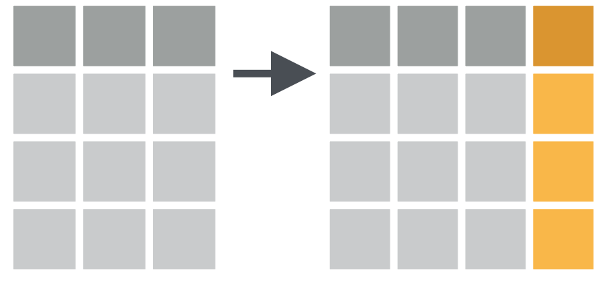
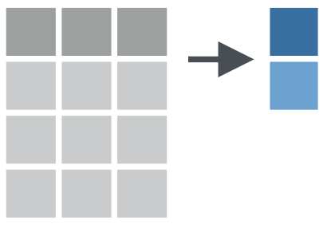

```{r setup, echo=FALSE}
library(xaringanExtra)
library(flair)
```

```{r xaringan-panelset, echo=FALSE}
xaringanExtra::use_panelset()
```

```{css, echo=FALSE}
pre {
  max-width: 100%;
  overflow-x: scroll;
}
```

# Christina Colwise

.pull-left[


]


.pull-right[
## General Background

- First-generation student part-way through her first year of a Psychology PhD program
]

---

# Christina Colwise

.pull-left[


]


.pull-right[
## Starting Point

- Has introductory working knowledge of the tidyverse

- Frequently uses common `dplyr` verbs for simple data transformations, e.g. creating new variables, summarizing data
]

---

# Christina Colwise

.pull-left[


]


.pull-right[
## Needs

- Wants to do more complex operations with `dplyr` verbs, e.g. apply data transformations to multiple columns at the same time
]

---

# Christina Colwise

.pull-left[


]


.pull-right[
## Special Considerations

- Works a full-time job during grad school

- Balances a heavy coursehold and has limited bandwidth to learn new things

- Wants to learn functions she can apply right away for analyzing data for her first year project 
]

---
background-image: url(../img/dplyr_hex_old.png)
background-position: 90% 5%
background-size: 10%

# Column-wise operations

e.g. Create a new column with `mutate()`

```{r echo = FALSE, out.width = "40%"}

```

e.g. Summarize data with `summarize()`

```{r echo = FALSE, out.width = "40%"}
knitr::include_graphics("../img/summarize_multiple.png")
```

---
background-image: url(../img/penguins_hex.png)
background-position: 90% 5%
background-size: 10%

# Palmer Penguins

```{r warning=FALSE, message=FALSE}
library(tidyverse)
library(palmerpenguins)
```

```{r}
glimpse(penguins)
```

---
background-image: url(../img/dplyr_hex_old.png)
background-position: 90% 5%
background-size: 10%

# Column-wise operations

Apply `summarize()` to a **single** column.

```{r echo = FALSE, out.width = "20%"}

```

--

.panelset[

.panel[.panel-name[Example]
Use `summarize()` to calculate the mean `bill length` for each `species` in the `penguins` dataset
]

.panel[.panel-name[Code]

```{r summarize-one-col, eval=FALSE}
penguins %>% 
  group_by(species) %>% 
  summarize(bill_length_mm_m = mean(bill_length_mm, na.rm = TRUE))
```
]

.panel[.panel-name[Output]

```{r echo=FALSE, message=FALSE}
penguins %>% 
  group_by(species) %>% 
  summarize(bill_length_mm_m = mean(bill_length_mm, na.rm = TRUE))
```

]
]
---
name: multiple columns
background-image: url(../img/dplyr_hex_old.png)
background-position: 90% 5%
background-size: 10%

# Column-wise operations

Apply `summarize()` to **multiple columns** at once

```{r echo = FALSE, out.width = "20%"}
knitr::include_graphics("../img/summarize_multiple.png")
```

--

.panelset[

.panel[.panel-name[Example #1]
e.g. Calculate the mean value of **all bill dimensions** (i.e. `bill_length`, `bill_depth`) for each species.
]

.panel[.panel-name[Code]
```{r eval=FALSE}
penguins %>% 
  group_by(species) %>% 
  summarize_at(vars(c(bill_length_mm, bill_depth_mm)), mean, na.rm = TRUE)
```

`summarize_at()` is an example of a **scoped verb**. It is a special variant of `summarize()` that applies a summary function to a specific set of multiple columns at once. 
]


.panel[.panel-name[Output]
```{r echo=FALSE, message=FALSE}
penguins %>% 
  group_by(species) %>% 
  summarize_at(vars(c(bill_length_mm, bill_depth_mm)), mean, na.rm = TRUE)
```
]
]

---
template: multiple columns

.panelset[

.panel[.panel-name[Example #2]
e.g. Calculate the mean value of **all numeric** variables for each species.
]

.panel[.panel-name[Code]
```{r eval=FALSE}
penguins %>% 
  group_by(species) %>% 
  summarize_if(is.numeric, mean, na.rm = TRUE)
```

`summarize_if()` is another example of a **scoped verb**. It is a special variant of `summarize()` that applies a summary function to a set of columns that all satisfy some logical criteria. That logical criteria is specified using a **predicate function**, e.g. `is.numeric()`. 

]

.panel[.panel-name[Output]
```{r echo=FALSE, message=FALSE}
penguins %>% 
  group_by(species) %>% 
  summarize_if(is.numeric, mean, na.rm = TRUE)
```
]
]
---
# Your Turn

Formative assessment #1?
Link to learnR app here
---
name: better way

# A better way?

.pull-left[
.center[
## `dplyr` < 1.0.0
```{r echo = FALSE, out.width = "50%"}
knitr::include_graphics("../img/dplyr_hex_old.png")
```

`summarize_at()`, `summarize_if()`, `summarize_all()`, `mutate_if()`, `mutate_at()`, `mutate_all()`, ...
##`r emo::ji("sweat")`
]
]

--

.pull-right[
.center[
## `dplyr` >= 1.0.0
```{r echo = FALSE, out.width = "50%"}
knitr::include_graphics("../img/dplyr_hex_new.png")
```

`across()`
<br><br><br>
##`r emo::ji("sunglasses")`
]
]

---
background-image: url(../img/dplyr_hex_new.png)
background-position: 90% 5%
background-size: 10%

# `dplyr::across()`


.pull-right[Artwork by @allison_horst]

---
background-image: url(../img/dplyr_hex_new.png)
background-position: 90% 5%
background-size: 10%

# `dplyr::across()`


.pull-right[Artwork by @allison_horst]
---
background-image: url(../img/dplyr_hex_new.png)
background-position: 90% 5%
background-size: 10%

# `dplyr::across()`

```{r across_spec, echo = FALSE}
decorate('across(.cols = everything(), .fns = NULL, ..., .names = NULL)', error = TRUE, eval=FALSE) %>% 
  flair(".cols = everything()", color = "cornflowerblue") %>% 
  flair(".fns = NULL", color = "red") %>% 
  flair("...", color = "orange") %>% 
  flair(".names = NULL", color = "darkorchid")
```

--

<span style="color: cornflowerblue"> `.cols` </span> = the columns you want to transform (all columns will be selected by default)

--

<span style="color: red">`.fns` </span> = the function(s) you want to apply to each of the selected columns

--

<span style="color: orange"> `...` </span> = additional arguments for the function(s) specified in `.fns`

--

<span style="color: darkorchid"> `.names` </span> = a `glue` specification that describes how you want to name the output columns of your transformation

---
background-image: url(../img/dplyr_hex_new.png)
background-position: 90% 5%
background-size: 10%

# `dplyr::across()`

```{r echo = FALSE}
decorate('across(.cols = everything(), .fns = NULL, ..., .names = NULL)', error = TRUE, eval=FALSE) %>% 
  flair(".cols = everything()", color = "cornflowerblue") %>% 
  flair(".fns = NULL", color = "red") %>% 
  flair("...", color = "orange") %>% 
  flair(".names = NULL", color = "darkorchid")
```

.panelset[

.panel[.panel-name[Example]
Use `across()` to calculate the mean of all numeric columns for each species in `penguins`
]

.panel[.panel-name[Code]
```{r across-example, include = FALSE, message=FALSE}
penguins %>% 
  group_by(species) %>% 
  summarize(across(where(is.numeric), mean, na.rm = TRUE, .names = '{col}_m'))
```

```{r echo=FALSE, message=FALSE}
decorate_chunk("across-example", eval = FALSE) %>% 
  flair("where(is.numeric)", color = "cornflowerblue") %>% 
  flair("mean", color = "red") %>% 
  flair("na.rm = TRUE", color = "orange") %>% 
  flair(".names = '{col}_m'", color = "darkorchid")
```


`where()` is an example of a `tidyselect` helper function. It selects the variables for which some predicate function , such as `is.numeric()`, returns `TRUE`. 

You can use any kind of `tidyselect` helper within `across`. For a full list of select helpers, see [here](https://dplyr.tidyverse.org/reference/select.html). 

Also see [here](https://tladeras.shinyapps.io/learning_tidyselect/) for a great interactive tutorial on `tidyselect` by [Ted Laderas](https://laderast.github.io/). 
]

.panel[.panel-name[Output]
```{r echo=FALSE, message=FALSE}
penguins %>% 
  group_by(species) %>% 
  summarize(across(where(is.numeric), mean, na.rm = TRUE, .names = '{col}_m'))
```
]
]

---
# Your Turn

Link to learnR app here

```{r}

```

---
# More resources

- [Blog post](https://www.tidyverse.org/blog/2020/04/dplyr-1-0-0-colwise/) by Hadley Wickham highlighting `across()` as a key component of the `dplyr` 1.0.0 update.

- [This vignette](https://dplyr.tidyverse.org/articles/colwise.html) on tidyverse.org about column-wise operations.

- Two blog posts by Rebecca Barter on [scoped verbs](http://www.rebeccabarter.com/blog/2019-01-23_scoped-verbs/) and [`across()`](http://www.rebeccabarter.com/blog/2020-07-09-across/).

- [Interactive tutorial](https://tladeras.shinyapps.io/learning_tidyselect/) by Ted Laderas on `tidyselect`.