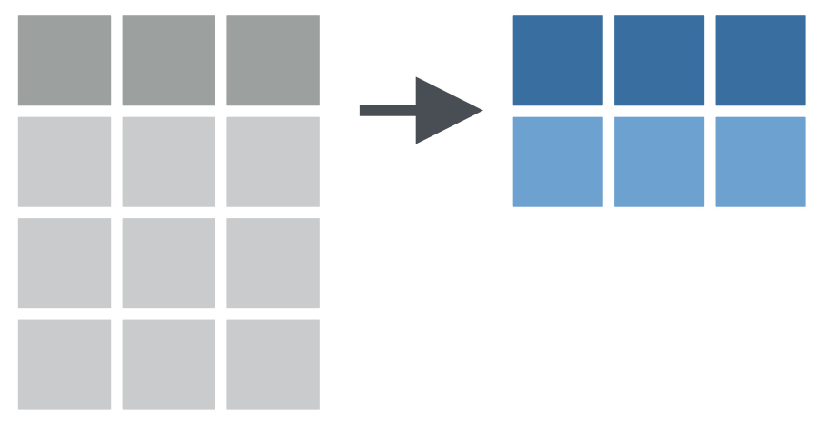

```{r setup, echo=FALSE}
library(xaringanExtra)

```

```{r xaringan-panelset, echo=FALSE}
xaringanExtra::use_panelset()
```

```{css, echo=FALSE}
pre {
  max-width: 100%;
  overflow-x: scroll;
}
```

# Christina Colwise

.pull-left[


]


.pull-right[
## General Background

- First-generation student part-way through her first year of a Psychology PhD program
]

---

# Christina Colwise

.pull-left[


]


.pull-right[
## Starting Point

- Has introductory working knowledge of the tidyverse

- Frequently uses common `dplyr` verbs for simple data transformations, e.g. creating new variables, summarizing data
]

---

# Christina Colwise

.pull-left[


]


.pull-right[
## Needs

- Wants to do more complex operations with `dplyr` verbs, e.g. apply data transformations to multiple columns at the same time
]

---

# Christina Colwise

.pull-left[


]


.pull-right[
## Special Considerations

- Works a full-time job during grad school

- Balances a heavy coursehold and has limited bandwidth to learn new things

- Wants to learn functions she can apply right away for analyzing data for her first year project 
]

---

# Column-wise operations

e.g. Create a new column with `mutate()`

```{r echo = FALSE, out.width = "40%"}
knitr::include_graphics("../img/mutate1.png")
```

e.g. Summarize data with `summarize()`

```{r echo = FALSE, out.width = "40%"}

```

---

# Palmer Penguins

```{r warning=FALSE, message=FALSE}
library(tidyverse)
library(palmerpenguins)
```

.pull-left[

```{r echo = FALSE, out.width = "50%"}
knitr::include_graphics("../img/penguins_hex.png")
```

]

.pull-right[ 
```{r}
glimpse(penguins)
```
]

---

# Column-wise operations

Apply `mutate()` to a **single** column.

```{r echo = FALSE, out.width = "40%"}
knitr::include_graphics("../img/mutate1.png")
```

--

.panelset[

.panel[.panel-name[Example]
Use `mutate()` to create a new column in `penguins` that represents *standardized* bill length
]

.panel[.panel-name[Code]

```{r mutate-one-col, eval=FALSE}
penguins %>% 
  mutate(bill_length_mm_z = scale(bill_length_mm)) %>% #<<
  glimpse()
```
]

.panel[.panel-name[Output]

```{r echo = FALSE}
penguins %>% 
  mutate(bill_length_mm_z = as.numeric(scale(bill_length_mm))) %>% 
  glimpse()
```

]
]
---
name: multiple columns

# Column-wise operations

Apply `mutate()` function to **multiple columns** at once?

```{r echo = FALSE, out.width = "40%"}
knitr::include_graphics("../img/mutate3.png")
```

--

e.g. Use `mutate()` to create new columns in `penguins` that represent standardized values for all body dimensions (`bill_length`, `bill_depth`, `flipper_length`)

```{r}
penguins %>% 
  mutate_at(vars(c("bill_length_mm", "bill_depth_mm", "flipper_length_mm")), list(scale = scale)) %>% names()

penguins %>% 
  mutate_at(vars(ends_with("_mm")), list(scale = scale)) %>% glimpse()
```


```{r eval=FALSE}
penguins %>% 
  mutate(bill_length_mm_z = scale(bill_length_mm),
         bill_depth_mm_z = scale(bill_depth_mm),
         flipper_length_mm_z = scale(flipper_length_mm))
```

---
template: multiple columns
---

```{r}
# penguins %>% 
#   mutate(bill_length_in = bill_length_mm * .04)

# penguins %>% 
#   mutate(across(.cols = ends_with("_mm"), .fns = ~.x * .04))
# 
# mm_to_in <- function(x) {x * .04}

# penguins %>% 
#   mutate(across(.cols = ends_with("_mm"), .fns = ~.x *.04, .names = str_subset("{col}", 1, 4)))

# penguins %>% 
#   mutate(across(.cols = ends_with("_mm"), .fns = ~.x *.04, .names = c("bill_length_in", "bill_depth_in", "flipper_length_in")))
```


---


